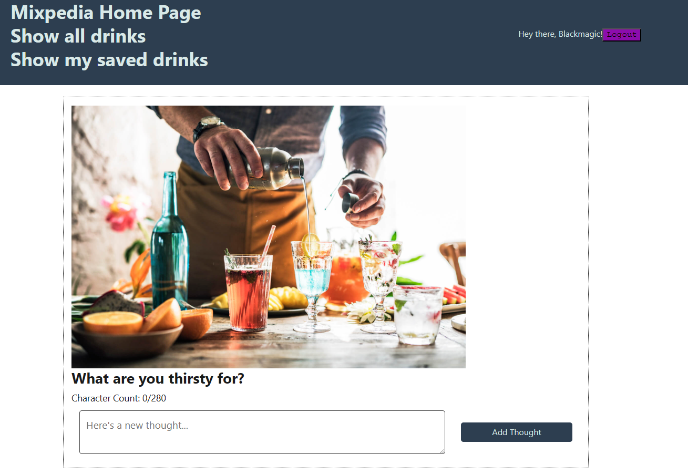

## Description
Mixpedia is a website application that lets you look at mixed drinks and save them so you can then later try them for your own purposes.

# Installation
-Npm i
-Npm run seeds
-Npm run develop

## Table of contents
#[DeployedApp](#DeployedApplication)
#[Screenshot](#Screenshot)
#[contributers](#Contributers)

## Deployed Application
Heroku

## Screenshot 

## Contributers
Jonathan Winter, Anthony Lanier, Luc Russel, Bronson Gonzalez